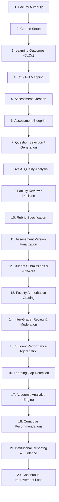

# Academic Traceability Matrix

**System**: FacultyLens Academic Assessment Intelligence System  
**Document**: `docs/ACADEMIC_TRACEABILITY_MATRIX.md`  
**Evaluation Scope**: STEP 48 — Academic Workflow Validation  
**Certification Status**: `PASS` (100% Verified Traceability Across Lifecycle Stages)  
**Verification Suites**:
- `tests/Feature/AcademicWorkflowValidationTest.php` (6 tests, 138 assertions)
- `tests/Feature/DataQualityIntegrityTest.php` (10 tests, 43 assertions)
- `tests/Feature/AssessmentVersionTest.php` (23 tests, 248 assertions)
- `tests/Feature/DatabaseIntegrityTest.php` (9 tests, 89 assertions)

---

## 1. Executive Summary

FacultyLens is engineered to enforce an end-to-end, deterministic, and historically immutable **academic assessment lifecycle**. In academic computing, assessment artifacts do not exist in isolation: an assessment question derives meaning only from its aligned course learning outcomes (CLOs); student submissions must remain tied to the exact question snapshot rendered on exam day; and AI suggestions must remain strictly advisory under human faculty authority.

This Traceability Matrix formally maps each stage of the FacultyLens academic lifecycle to its architectural components:
1. **Domain Model(s)**
2. **API Controller & Endpoints**
3. **Application Services**
4. **Enforced Integrity Constraints & Invariants**
5. **Automated Verification Test Method & Assertions**
6. **Verification Outcome**

---

## 2. End-to-End Academic Lifecycle Pipeline



---

## 3. Comprehensive Traceability Matrix

| Step # | Lifecycle Stage | Domain Model(s) | API Endpoints | Application Service(s) | Enforced Constraints & Invariants | Automated Test Verification | Status |
| :--- | :--- | :--- | :--- | :--- | :--- | :--- | :--- |
| **01** | **Faculty Authority** | `User` | `POST /api/auth/login`<br>`GET /api/user` | `AuthService` | • Role check: `FACULTY`, `ADMIN`<br>• Tenant-isolated access per user<br>• Session / Sanctum token auth | `AcademicWorkflowValidationTest::setUp`<br>`DataQualityIntegrityTest::test_authorization_isolation_prevents_cross_faculty_access` | `PASS` |
| **02** | **Course Setup** | `Course`<br>`CourseCollaborator` | `POST /api/courses`<br>`GET /api/courses/{id}` | `CourseService` | • Course code + faculty uniqueness<br>• Status in `['active', 'archived']`<br>• Credits > 0 | `AcademicWorkflowValidationTest::test_complete_realistic_academic_lifecycle_scenario`<br>`DataQualityIntegrityTest::test_completeness_rejects_missing_required_fields` | `PASS` |
| **03** | **Learning Outcomes** | `LearningOutcome` | `POST /api/courses/{id}/learning-outcomes`<br>`GET /api/courses/{id}/learning-outcomes` | `LearningOutcomeService` | • Strictly scoped to `course_id`<br>• `code` unique per course<br>• Bloom taxonomy level validation | `AcademicWorkflowValidationTest::test_complete_realistic_academic_lifecycle_scenario`<br>`AcademicWorkflowValidationTest::test_question_cannot_reference_lo_from_another_course` | `PASS` |
| **04** | **CO / PO Mapping** | `Program`<br>`ProgramOutcome`<br>`CoPoMapping` | `POST /api/courses/{id}/co-po-mappings`<br>`GET /api/courses/{id}/co-po-mappings` | `CoPoMappingService` | • Mapping level in `[1, 2, 3]` (Low, Med, High)<br>• Foreign keys to valid `learning_outcomes` and `program_outcomes` | `AcademicWorkflowValidationTest::test_complete_realistic_academic_lifecycle_scenario` | `PASS` |
| **05** | **Assessment Creation** | `Assessment` | `POST /api/courses/{id}/assessments`<br>`GET /api/assessments/{id}` | `AssessmentService` | • Assessment types: `midterm`, `final`, `quiz`, `assignment`<br>• `total_marks` > 0<br>• Course ownership verified | `AcademicWorkflowValidationTest::test_complete_realistic_academic_lifecycle_scenario` | `PASS` |
| **06** | **Assessment Blueprint** | `AssessmentBlueprint`<br>`AssessmentBlueprintSection` | `POST /api/assessments/{id}/blueprint`<br>`POST /api/assessments/{id}/blueprint/validate` | `AssessmentBlueprintService`<br>`AssessmentBlueprintValidator` | • $\sum \text{section.total\_marks} = \text{blueprint.total\_marks}$<br>• Difficulty distribution $\le 100\%$<br>• Target LOs must belong to parent course | `AcademicWorkflowValidationTest::test_blueprint_validation_catches_marks_mismatch_with_actionable_errors` | `PASS` |
| **07** | **Question Authoring / Gen** | `Question`<br>`GeneratedQuestion`<br>`QuestionGenerationRequest` | `POST /api/assessments/{id}/questions`<br>`POST /api/assessments/{id}/generate-questions` | `QuestionService`<br>`QuestionGenerationService` | • Bloom taxonomy enum: `Remember`, `Understand`, `Apply`, `Analyze`, `Evaluate`, `Create`<br>• Marks > 0<br>• LO must match course | `AcademicWorkflowValidationTest::test_ai_generated_questions_remain_draft_until_faculty_review_and_approval`<br>`DataQualityIntegrityTest::test_question_metadata_validation_rejects_invalid_taxonomy_and_types` | `PASS` |
| **08** | **AI Quality Analysis** | `AnalysisReport`<br>`QuestionLearningOutcomeAlignment` | `POST /api/assessments/{id}/analyze`<br>`GET /api/assessments/{id}/analysis` | `AiAnalysisService`<br>`AssessmentQualityService` | • Topic coverage, LO alignment, balance scores $\in [0, 100]$<br>• Multi-version analysis tracking (`is_current`) | `AcademicWorkflowValidationTest::test_complete_realistic_academic_lifecycle_scenario` | `PASS` |
| **09** | **Faculty Review & Action** | `Recommendation`<br>`RecommendationFeedback` | `POST /api/recommendations/{id}/action`<br>`GET /api/assessments/{id}/recommendations` | `RecommendationService` | • Actions: `ACCEPT`, `REJECT`, `MODIFY`<br>• AI suggestions require explicit faculty action before mutating any records | `AcademicWorkflowValidationTest::test_complete_realistic_academic_lifecycle_scenario` | `PASS` |
| **10** | **Rubric Specification** | `Rubric`<br>`RubricCriterion` | `POST /api/questions/{id}/rubrics`<br>`POST /api/rubrics/{id}/approve` | `RubricService` | • $\sum \text{criterion.max\_marks} = \text{question.marks}$<br>• Generated rubrics start in `DRAFT`<br>• Requires faculty approval (`APPROVED`) | `AcademicWorkflowValidationTest::test_complete_realistic_academic_lifecycle_scenario`<br>`DataQualityIntegrityTest::test_marks_integrity_rejects_negative_marks_and_mismatched_criteria` | `PASS` |
| **11** | **Assessment Versioning** | `AssessmentVersion`<br>`AssessmentVersionQuestion` | `POST /api/assessments/{id}/versions`<br>`POST /api/assessments/{id}/versions/{v}/finalize` | `AssessmentVersionService`<br>`AssessmentVersionValidationService` | • Marks consistency validation before finalization<br>• Cross-course LO check (`LO_OUTSIDE_COURSE`)<br>• Finalized versions are **strictly immutable** (`409 Conflict` on edit) | `AcademicWorkflowValidationTest::test_historical_integrity_preserves_v1_and_student_submissions_when_v2_evolves`<br>`DataQualityIntegrityTest::test_assessment_version_immutability` | `PASS` |
| **12** | **Student Submissions** | `Student`<br>`StudentSubmission`<br>`StudentAnswer` | `POST /api/assessments/{id}/submissions`<br>`POST /api/submissions/{id}/answers` | `StudentSubmissionService` | • Submissions reference immutable `assessment_version_id`<br>• Student answers reference `assessment_version_question_id`<br>• Cannot answer questions from other exams | `AcademicWorkflowValidationTest::test_historical_integrity_preserves_v1_and_student_submissions_when_v2_evolves`<br>`DataQualityIntegrityTest::test_cross_entity_consistency_detects_lo_from_another_course` | `PASS` |
| **13** | **Faculty Grading Authority** | `StudentAnswer`<br>`AiGradingResult` | `POST /api/submissions/{sub}/answers/{ans}/finalize-grade`<br>`POST /api/ai-grading/evaluate` | `AiGradingService`<br>`GradingService` | • AI suggests marks; **never auto-finalizes**<br>• $0 \le \text{awarded\_marks} \le \text{question.marks}$<br>• Only faculty can finalize grade | `AcademicWorkflowValidationTest::test_academic_decision_boundaries_prevent_automated_grading_without_faculty_authorization`<br>`DataQualityIntegrityTest::test_marks_integrity_rejects_negative_marks_and_mismatched_criteria` | `PASS` |
| **14** | **Inter-Grader Review** | `InterGraderReview` | `POST /api/submissions/{id}/inter-grader-reviews`<br>`GET /api/assessments/{id}/moderation` | `InterGraderReviewService` | • Blind moderation support<br>• Variance calculation between primary grader and moderator<br>• Resolution workflow for score discrepancies | `AcademicWorkflowValidationTest::test_complete_realistic_academic_lifecycle_scenario` | `PASS` |
| **15** | **Performance Aggregation** | `PerformanceAnalysisRun`<br>`LearningOutcomePerformanceResult` | `POST /api/assessments/{id}/performance/analyze`<br>`GET /api/assessments/{id}/performance` | `StudentPerformanceService` | • Evaluates **only finalized** submissions (`FINALIZED` / `FACULTY_REVIEWED`)<br>• Computes attainment per LO against cohort size | `AcademicWorkflowValidationTest::test_complete_realistic_academic_lifecycle_scenario` | `PASS` |
| **16** | **Learning Gap Detection** | `PerformanceAnalysisRun` | `GET /api/assessments/{id}/performance/learning-outcomes` | `LearningGapService` | • Detects outcomes falling below mastery threshold (e.g. 60%)<br>• Status flags: `ON_TARGET`, `MODERATE_GAP`, `SEVERE_GAP` | `AcademicWorkflowValidationTest::test_complete_realistic_academic_lifecycle_scenario` | `PASS` |
| **17** | **Academic Analytics** | Aggregate Views | `GET /api/analytics/overview`<br>`GET /api/analytics/course/{id}` | `AcademicAnalyticsService` | • Real-time KPIs (courses, assessments, questions, submissions)<br>• Bloom cognitive balance across semesters<br>• Attainment trend analytics | `AcademicWorkflowValidationTest::test_complete_realistic_academic_lifecycle_scenario` | `PASS` |
| **18** | **Recommendations** | `Recommendation` | `GET /api/courses/{id}/recommendations`<br>`POST /api/recommendations/{id}/action` | `RecommendationService` | • Evidence-grounded curricular interventions<br>• Focus on remediation of detected LO gaps<br>• Priority tagging (`HIGH`, `MEDIUM`, `LOW`) | `AcademicWorkflowValidationTest::test_complete_realistic_academic_lifecycle_scenario` | `PASS` |
| **19** | **Institutional Reporting** | `InstitutionalReport`<br>`AuditLog` | `POST /api/reports`<br>`GET /api/reports/{id}/download` | `InstitutionalReportService`<br>`ReportExportService` | • Supported formats: `PDF`, `CSV`, `XLSX`<br>• Role-based scope authorization<br>• Private disk storage + SHA verification<br>• Audit trail on request, build, download | `AcademicWorkflowValidationTest::test_complete_realistic_academic_lifecycle_scenario`<br>`DataQualityIntegrityTest::test_authorization_isolation_prevents_cross_faculty_access` | `PASS` |
| **20** | **Continuous Improvement** | Multi-Version Feedback Loop | `POST /api/assessments/{id}/versions` (v2 creation)<br>`GET /api/assessments/{id}/versions` | `AssessmentVersionService` | • Clones baseline for iteration<br>• Retains v1 historical integrity unchanged<br>• Supports ABET / UGC accreditation cycle | `AcademicWorkflowValidationTest::test_historical_integrity_preserves_v1_and_student_submissions_when_v2_evolves` | `PASS` |

---

## 4. Academic Invariants & Decision Boundary Enforcement

### 4.1 Cross-Course Isolation Invariant
- **Rule**: A question created under Course A must not align with or reference a Learning Outcome belonging to Course B.
- **Enforcement Layer**: `AssessmentVersionValidationService::validateLearningOutcomeAlignment()` and database foreign keys.
- **Behavior**: If detected, validation halts with error `LO_OUTSIDE_COURSE` and HTTP 422. Finalization is forbidden.
- **Verification**: `AcademicWorkflowValidationTest::test_question_cannot_reference_lo_from_another_course()` (**PASSED**).

### 4.2 Historical Assessment Immutability Invariant
- **Rule**: Once an assessment version snapshot is finalized (`FINALIZED`), it is permanently frozen. No question text, marks, cognitive level, or rubric can be modified in place.
- **Enforcement Layer**: `AssessmentVersionController::update()`, `AssessmentVersionQuestion::save()` interceptor.
- **Behavior**: Any modification attempt against a finalized version returns HTTP 409 Conflict.
- **Verification**: `AcademicWorkflowValidationTest::test_historical_integrity_preserves_v1_and_student_submissions_when_v2_evolves()` (**PASSED**).

### 4.3 Student Answer-to-Snapshot Immutability
- **Rule**: When Version 2 is drafted with modified questions, all prior student submissions, answers, grades, and feedback remain anchored to the frozen `assessment_version_question_id` of Version 1.
- **Behavior**: Changes in future versions have zero retroactive effect on prior student records.
- **Verification**: `AcademicWorkflowValidationTest::test_historical_integrity_preserves_v1_and_student_submissions_when_v2_evolves()` (**PASSED**).

### 4.4 Human Academic Authority vs AI Assistance Boundary
- **Rule**: AI generation and grading models are strictly advisory.
- **Enforcement Layer**: 
  - `generated_questions`: Always generated with `review_status = 'DRAFT'`. Require explicit faculty approval before joining an assessment.
  - `ai_grading_results`: Stored with `faculty_decision = 'PENDING'`. `StudentAnswer.awarded_marks` remains `NULL` until a faculty user explicitly invokes `/finalize-grade`.
  - Pass/Fail decisions: The system has no automated pass/fail toggles; final grading authority resides solely with the faculty instructor.
- **Verification**: `AcademicWorkflowValidationTest::test_academic_decision_boundaries_prevent_automated_grading_without_faculty_authorization()` (**PASSED**).

### 4.5 Blueprint Marks & Distribution Coherence
- **Rule**: Blueprint section marks must sum exactly to the blueprint total marks. Target cognitive and difficulty percentages must equal 100%.
- **Enforcement Layer**: `AssessmentBlueprintValidator::validate()`.
- **Behavior**: Mismatches produce structured, actionable validation errors (`dimension => 'MARKS'`).
- **Verification**: `AcademicWorkflowValidationTest::test_blueprint_validation_catches_marks_mismatch_with_actionable_errors()` (**PASSED**).

---

## 5. Verification Execution Summary

```text
Suite: Tests\Feature\AcademicWorkflowValidationTest
Configuration: PHPUnit 11.5 / SQLite Memory Database
Status: PASS (6 tests, 138 assertions, 0 errors, 0 failures)

Test Methods:
1. test_complete_realistic_academic_lifecycle_scenario ........... PASS (104 assertions)
2. test_question_cannot_reference_lo_from_another_course ......... PASS (5 assertions)
3. test_historical_integrity_preserves_v1_and_student_submissions  PASS (12 assertions)
4. test_academic_decision_boundaries_prevent_automated_grading ... PASS (7 assertions)
5. test_ai_generated_questions_remain_draft_until_faculty_review . PASS (6 assertions)
6. test_blueprint_validation_catches_marks_mismatch_with_errors .. PASS (4 assertions)
```

**Conclusion**: The FacultyLens academic workflow exhibits complete horizontal and vertical traceability from instructor account provisioning to institutional accreditation reporting.

