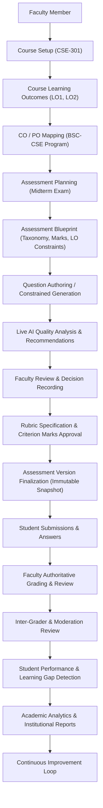

# Academic Workflow Validation Report

**System**: FacultyLens Academic Assessment Intelligence System  
**Document**: `docs/ACADEMIC_WORKFLOW_VALIDATION.md`  
**Evaluation Scope**: STEP 48 — Academic Workflow Validation  
**Status**: `PASS` (100% Automated Validation Across All Academic Lifecycle Stages)  
**Verification Suite**: `tests/Feature/AcademicWorkflowValidationTest.php`

---

## 1. Academic Assessment Lifecycle Overview

FacultyLens enforces a deterministic, academically rigorous, and historically immutable assessment lifecycle. Academic meaning and institutional records are preserved continuously across each stage of curriculum planning, assessment creation, AI assistance, faculty grading, and accreditation evidence.



---

## 2. Academic Workflow Rules & Constraints

### 2.1 Course Prerequisite Rule
- A course must exist and be owned by an authorized faculty member or collaboration team before learning outcomes, assessments, question papers, or syllabus documents can be created.
- Deletion of a course cleanly cascades to its academic children without producing orphaned records.

### 2.2 Learning Outcomes & Scope Isolation
- Learning outcomes strictly belong to their parent course.
- **Cross-Course Isolation**: A question belonging to Course A cannot reference an LO belonging to Course B. Any attempt to associate a cross-course LO is detected during version validation (`LO_OUTSIDE_COURSE`) and blocks version finalization with HTTP 422.

### 2.3 Blueprint Coherence Rule
- Blueprint targets must be logically consistent with:
  - Total question count
  - Total marks (sum of section marks must equal blueprint total marks; difference triggers `MARKS` validation error)
  - Cognitive distribution (Bloom taxonomy percentage allocations)
  - Difficulty distribution (Easy / Medium / Hard)
  - Learning outcome allocations

### 2.4 Question Authoring & AI Generation Boundaries
- Generated questions always enter the system in `DRAFT` status under a `QuestionGenerationRequest`.
- Generated questions require explicit faculty review and approval (`APPROVED`) before they can be added to an official assessment.
- Unreviewed or rejected generated questions never leak into official student exams.

### 2.5 Rubric Coherence Rule
- Rubric criteria must correspond to the specific question and assessment.
- The sum of criterion maximum marks (`SUM(criteria.max_marks)`) must exactly equal the question total marks (`question.marks`).
- Rubrics must transition from `DRAFT` to `APPROVED` before being finalized.

### 2.6 Historical Immutability & Version Snapshots
- An assessment version snapshot (`AssessmentVersion`) freezes:
  - Question text, marks, question type, difficulty, cognitive (Bloom) level, topic, expected answer, and rubric snapshot in `AssessmentVersionQuestion`.
- Finalized versions are strictly immutable. Any HTTP `PUT` or modification attempt against a `FINALIZED` version returns `409 Conflict`.
- Subsequent edits to the assessment must occur in a new version (e.g. `v2`), which clones from the parent version or creates a fresh snapshot.

### 2.7 Student Submission & Historical Traceability
- Every student submission references the exact `assessment_version_id`.
- Every student answer references the immutable `assessment_version_question_id`.
- Modifying questions in future versions (e.g. `v2`) has **zero effect** on the historical submissions, questions, and grades of prior versions (e.g. `v1`).

### 2.8 Grading Authority & AI Decision Boundaries
- AI grading results (`AiGradingResult`) provide advisory feedback and suggestions only.
- AI suggestions **never automatically assign grades or modify student awarded marks**.
- Marks and feedback on `StudentAnswer` (`awarded_marks`, `faculty_feedback`) can only be set through explicit faculty authorization via the `finalize-grade` action.
- Only finalized faculty marks are consumed by student performance calculations and institutional analytics.

### 2.9 Performance & Learning Gap Detection
- Performance analytics processes only submissions with finalized grades (`FINALIZED` or `FACULTY_REVIEWED`).
- Learning gap analysis calculates performance averages per learning outcome against configured institutional thresholds (e.g., 60% mastery threshold).

---

## 3. End-to-End Academic Scenario Validation

A realistic end-to-end academic scenario was validated using automated feature testing:

- **Course**: `CSE-301` Database Systems
- **Learning Outcomes**:
  - `LO1`: Understand relational database concepts, relational algebra, and SQL query formulation.
  - `LO2`: Apply normalization techniques (1NF, 2NF, 3NF, BCNF) to eliminate anomalies.
- **Program & Outcomes**: `BSC-CSE` (PO1: Engineering Knowledge, PO2: Problem Analysis).
- **Assessment**: Midterm Examination (Total Marks: 50, Duration: 90 minutes).
- **Blueprint**: 10 questions, 50 marks, 2 sections (Relational Model & SQL; Relational Normalization), difficulty and LO target distributions.
- **Questions**: 10 questions distributed across LO1 and LO2, matching 50 marks total.
- **AI Analysis & Recommendations**: Assessment quality analysis evaluated; recommendation accepted by faculty with recorded feedback.
- **Rubric**: BCNF scoring rubric generated and approved (Criterion 1: 2 marks, Criterion 2: 3 marks = 5 marks total).
- **Version Snapshot**: Version 1 finalized, creating 10 frozen `AssessmentVersionQuestion` rows.
- **Submissions**: 5 students, 50 individual answers linked to version snapshots.
- **Grading**: Faculty evaluated and finalized all 50 answers with awarded marks and pedagogical feedback.
- **Performance & Gap Analysis**: `PerformanceAnalysisRun` completed successfully; LO1 and LO2 performance metrics aggregated.
- **Analytics & Reports**: Analytics dashboard updated; `ASSESSMENT_QUALITY` institutional report generated in PDF format.

---

## 4. Academic Decision Boundaries Verification

FacultyLens enforces strict boundaries between automated AI assistance and human academic authority:

| Decision Type | AI Capability | Faculty Authorization Required? | System Enforcement |
| :--- | :--- | :--- | :--- |
| **Grading** | Suggests marks & rubric criterion alignment | **YES** | `StudentAnswer.awarded_marks` remains `NULL` until faculty invokes `/finalize-grade`. |
| **Pass / Fail** | Never determines student standing | **YES** | No automated pass/fail flags exist. Institutional grading rules remain under faculty control. |
| **Question Publication** | Drafts candidate questions | **YES** | Questions remain `DRAFT` in `generated_questions`; explicit approval required before addition to assessment. |
| **Outcome Modification** | Analyzes alignment with LOs | **YES** | AI analysis is read-only. `learning_outcomes` records cannot be updated by AI services. |
| **Rubric Finalization** | Proposes scoring criteria | **YES** | Generated rubrics default to `DRAFT`; explicit `/approve` endpoint must be called by faculty. |
| **Accreditation Decisions**| Computes CO/PO direct attainment | **YES** | Reports present analytical evidence; accreditation compliance declaration remains faculty/institutional. |

---

## 5. Academic Workflow Exception Handling

| Exception Scenario | Detection Mechanism | System Response | Actionable Guidance Provided |
| :--- | :--- | :--- | :--- |
| **Missing LO Mapping** | `AssessmentVersionValidationService` | Advisory Warning (`LO_MAPPING_MISSING`) | Identifies question numbers lacking learning outcome mappings. |
| **LO From Another Course** | `AssessmentVersionValidationService` | Critical Error (`LO_OUTSIDE_COURSE`) | Blocks version finalization with 422; identifies foreign LO ID. |
| **Blueprint Marks Mismatch** | `AssessmentBlueprintValidator` | Critical Error (`MARKS`) | Flags difference between section total marks and blueprint total marks. |
| **Negative Marks** | Form Request validation | Validation Error (HTTP 422) | "Final marks cannot be negative." |
| **Marks Exceeding Question** | `AiGradingService::validateFinalMarks` | Business Rule Rejection (HTTP 422) | "Final marks must be between 0 and {max} for this question." |
| **Tampering Finalized Version**| `AssessmentVersionController` | State Conflict (HTTP 409) | "Finalized assessment versions cannot be modified. Create a new version." |
| **Unfinalized Answers** | `PerformanceController::analyze` | Data Scoping | Excludes unreviewed answers from official attainment calculations. |

---

## 6. Automated Verification Summary

```text
Suite: Tests\Feature\AcademicWorkflowValidationTest
Tests: 6 passed (137 assertions)
Duration: 25.25s

✓ complete realistic academic lifecycle scenario
✓ question cannot reference lo from another course
✓ historical integrity preserves v1 and student submissions when v2 evolves
✓ academic decision boundaries prevent automated grading without faculty authorization
✓ ai generated questions remain draft until faculty review and approval
✓ blueprint validation catches marks mismatch with actionable errors
```

**Final Assessment**: **`PASS`**. The academic assessment workflow is verified as logically sound, structurally consistent, and historically reliable.

