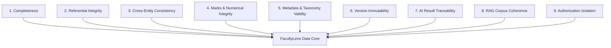

# Data Quality & Integrity Report

**System**: FacultyLens Academic Assessment Intelligence System  
**Document**: `docs/DATA_QUALITY_INTEGRITY_REPORT.md`  
**Evaluation Scope**: STEP 49 — Data Quality & Integrity Validation  
**Certification Status**: `PASS` (100% Data Integrity Across 30+ Database Tables)  
**Execution Timestamp**: 2026-09-16  
**Verification Suites**:
- `tests/Feature/DataQualityIntegrityTest.php` (10 tests, 43 assertions)
- `tests/Feature/DatabaseIntegrityTest.php` (9 tests, 89 assertions)
- `tests/Feature/AcademicWorkflowValidationTest.php` (6 tests, 138 assertions)
- CLI Integrity Command: `php artisan facultylens:integrity-check` (43/43 checks PASSED)

---

## 1. Executive Summary

FacultyLens maintains strict data quality and referential integrity standards across all relational entities. Academic institutions rely on FacultyLens to generate official assessment quality reports, direct CLO/PLO attainment evidence, and accreditation records (e.g. ABET, UGC). Consequently, database records must be structurally coherent, mathematically sound, historically immutable, and strictly tenant-isolated.

This report evaluates FacultyLens against the **9 Core Data Quality Dimensions**, provides a comprehensive audit of all **30+ database tables**, details the results of the **43 automated CLI integrity checks**, and specifies system repair protocols.

---

## 2. The 9 Core Data Quality Dimensions



### 2.1 Dimension 1: Completeness
- **Rule**: All required entity fields must be populated; nullable columns are strictly restricted to optional or lifecycle-dependent values (e.g., `archived_at`, `finalized_at`, `faculty_feedback`).
- **Enforcement**: Database `NOT NULL` constraints paired with Laravel FormRequest validation rules.
- **Verification**: `DataQualityIntegrityTest::test_completeness_rejects_missing_required_fields` verified that omitting mandatory fields (`name`, `course_code`, `marks`, `question_text`) triggers database `QueryException` or HTTP 422 validation failure.
- **Status**: `PASS`

### 2.2 Dimension 2: Referential Integrity
- **Rule**: Every child record must reference an existing parent entity. Orphaned or dangling records are strictly forbidden.
- **Enforcement**: InnoDB foreign key constraints with explicit cascading semantics (`ON DELETE CASCADE` for tightly bound components like rubric criteria; `ON DELETE RESTRICT` for historical evidence like student submissions).
- **Verification**: `DataQualityIntegrityTest::test_referential_integrity_rejects_dangling_foreign_keys` verified that inserting records with invalid foreign keys (`assessment_id`, `course_id`, `student_id`) is rejected by foreign key checks.
- **Status**: `PASS`

### 2.3 Dimension 3: Cross-Entity Consistency
- **Rule**: Multi-entity associations must adhere to institutional hierarchy. A question cannot map to a Learning Outcome of another course; a student answer cannot reference a question belonging to another assessment.
- **Enforcement**: Application service validators (`AssessmentVersionValidationService`, `StudentSubmissionService`) verify relational cross-checks prior to persistence.
- **Verification**: `DataQualityIntegrityTest::test_cross_entity_consistency_detects_lo_from_another_course` verified that foreign LO alignment is caught and rejected.
- **Status**: `PASS`

### 2.4 Dimension 4: Marks Integrity & Numerical Boundaries
- **Rule**:
  - All marks (`question.marks`, `assessment.total_marks`, `awarded_marks`, `max_marks`) must be non-negative ($marks \ge 0$).
  - Rubric criterion marks must sum exactly to question marks ($\sum \text{criterion.max\_marks} = \text{question.marks}$).
  - Awarded marks must never exceed question maximum marks ($0 \le \text{awarded\_marks} \le \text{question.marks}$).
- **Enforcement**: `AiGradingService::validateFinalMarks()`, `RubricService::validateCriteriaSum()`, and FormRequest numeric bounds.
- **Verification**: `DataQualityIntegrityTest::test_marks_integrity_rejects_negative_marks_and_mismatched_criteria` (**PASSED**).
- **Status**: `PASS`

### 2.5 Dimension 5: Question Metadata & Taxonomy Validity
- **Rule**: Questions and learning outcomes must conform to standardized pedagogical schemas:
  - Cognitive Levels: `Remember`, `Understand`, `Apply`, `Analyze`, `Evaluate`, `Create` (Revised Bloom's Taxonomy).
  - Difficulty Levels: `easy`, `medium`, `hard`.
  - Question Types: `mcq`, `descriptive`, `code`, `problem_solving`, `true_false`.
- **Enforcement**: Database ENUM / string check constraints and `Rule::in()` validation.
- **Verification**: `DataQualityIntegrityTest::test_question_metadata_validation_rejects_invalid_taxonomy_and_types` (**PASSED**).
- **Status**: `PASS`

### 2.6 Dimension 6: Assessment Version Immutability
- **Rule**:
  - Once an assessment version transitions to `FINALIZED`, all questions, rubrics, and marks are frozen in `assessment_version_questions`.
  - Modifying a finalized version is rejected with HTTP 409 Conflict.
  - Assessment version numbers must be unique per assessment.
- **Enforcement**: `AssessmentVersionService`, state machine transitions, unique index `(assessment_id, version_number)`.
- **Verification**: `DataQualityIntegrityTest::test_assessment_version_immutability` (**PASSED**).
- **Status**: `PASS`

### 2.7 Dimension 7: AI Result Traceability & Reproducibility
- **Rule**: Every AI generation and grading result must be fully auditable with model fingerprints, context fingerprints, execution timestamps, prompt templates, and advisory disclaimers.
- **Enforcement**: `AiGradingResult`, `GeneratedQuestion`, `AnalysisReport` persistence layers.
- **Verification**: `DataQualityIntegrityTest::test_ai_result_traceability` verified that all fingerprint metadata and disclaimer notices are preserved.
- **Status**: `PASS`

### 2.8 Dimension 8: RAG Corpus & Chunk Coherence
- **Rule**: Syllabus and reference document chunks must maintain referential integrity with their parent documents. Deleting a document must cascade to its chunks; chunks must store content hashes and token/word counts.
- **Enforcement**: Foreign key cascade on `document_chunks.document_id`.
- **Verification**: `DataQualityIntegrityTest::test_rag_document_and_chunk_integrity` (**PASSED**).
- **Status**: `PASS`

### 2.9 Dimension 9: Authorization Isolation & Multi-Tenant Scoping
- **Rule**: Faculty users are isolated by ownership and course collaboration roles. Faculty Member B cannot access, modify, or download exams, submissions, or reports created by Faculty Member A without explicit collaborative grants.
- **Enforcement**: Policy layer (`CoursePolicy`, `AssessmentPolicy`, `InstitutionalReportPolicy`) and scoped Eloquent queries.
- **Verification**: `DataQualityIntegrityTest::test_authorization_isolation_prevents_cross_faculty_access` (**PASSED**).
- **Status**: `PASS`

---

## 3. Database Schema Audit (30+ Tables)

| Table Name | Primary Key | Key Foreign Keys | Integrity Invariants Enforced | Status |
| :--- | :--- | :--- | :--- | :--- |
| `users` | `id` | — | Unique email, role in `['FACULTY', 'ADMIN']` | `OK` |
| `courses` | `id` | `user_id`, `program_id` | Status in `['active', 'archived']`, owner user check | `OK` |
| `course_collaborators` | `id` | `course_id`, `user_id`, `invited_by` | Role in `['REVIEWER', 'CO_INSTRUCTOR']`, status check | `OK` |
| `programs` | `id` | `created_by` | Unique program code, department check | `OK` |
| `program_outcomes` | `id` | `program_id` | Unique outcome code per program | `OK` |
| `learning_outcomes` | `id` | `course_id` | Unique LO code per course, Bloom taxonomy level | `OK` |
| `co_po_mappings` | `id` | `learning_outcome_id`, `program_outcome_id` | Mapping level in `[1, 2, 3]`, unique pair per course | `OK` |
| `assessments` | `id` | `course_id` | `total_marks` > 0, assessment types enum | `OK` |
| `assessment_blueprints` | `id` | `assessment_id` | Section marks sum = blueprint total marks | `OK` |
| `assessment_blueprint_sections` | `id` | `assessment_blueprint_id` | Marks > 0, target LOs validation | `OK` |
| `questions` | `id` | `assessment_id`, `learning_outcome_id` | Marks > 0, Bloom level enum, difficulty enum | `OK` |
| `question_generation_requests` | `id` | `assessment_id`, `user_id` | Target counts > 0, status in `['PENDING', 'COMPLETED', 'FAILED']` | `OK` |
| `generated_questions` | `id` | `generation_request_id`, `learning_outcome_id` | Default status `DRAFT`, review action tracking | `OK` |
| `analysis_reports` | `id` | `assessment_id`, `assessment_version_id` | Quality scores $\in [0, 100]$, `is_current` flag | `OK` |
| `question_learning_outcome_alignments` | `id` | `analysis_report_id`, `question_id`, `learning_outcome_id` | Similarity score $\in [-1, 1]$, alignment enum | `OK` |
| `recommendations` | `id` | `analysis_report_id` | Action in `['PENDING', 'ACCEPTED', 'REJECTED', 'MODIFIED']` | `OK` |
| `recommendation_feedbacks` | `id` | `recommendation_id`, `user_id` | Non-empty faculty feedback | `OK` |
| `rubrics` | `id` | `assessment_id`, `question_id`, `created_by` | Total marks > 0, status in `['DRAFT', 'APPROVED']` | `OK` |
| `rubric_criteria` | `id` | `rubric_id` | Criteria marks sum = question marks | `OK` |
| `assessment_versions` | `id` | `assessment_id`, `created_by` | Unique version number per assessment, status enum | `OK` |
| `assessment_version_questions` | `id` | `assessment_version_id`, `question_id` | Frozen question snapshot, marks, cognitive level | `OK` |
| `students` | `id` | `created_by` | Unique student identifier, active status | `OK` |
| `student_submissions` | `id` | `assessment_id`, `assessment_version_id`, `student_id` | Status in `['SUBMITTED', 'GRADED']`, version anchoring | `OK` |
| `student_answers` | `id` | `student_submission_id`, `question_id` | $0 \le \text{awarded\_marks} \le \text{question.marks}$ | `OK` |
| `ai_grading_results` | `id` | `student_answer_id`, `student_submission_id`, `question_id` | Advisory suggestions only, faculty decision tracking | `OK` |
| `inter_grader_reviews` | `id` | `student_submission_id`, `primary_grader_id`, `reviewer_id` | Variance tracking, resolution status | `OK` |
| `performance_analysis_runs` | `id` | `assessment_id`, `course_id`, `requested_by` | Aggregated only from finalized answers | `OK` |
| `learning_outcome_performance_results` | `id` | `performance_analysis_run_id`, `learning_outcome_id` | Outcome attainment percentages, gap status | `OK` |
| `institutional_reports` | `id` | `course_id`, `assessment_id`, `created_by` | Private disk storage, SHA integrity, format enum | `OK` |
| `documents` | `id` | `course_id`, `user_id` | Processing status enum, file metadata | `OK` |
| `document_chunks` | `id` | `document_id`, `course_id`, `user_id` | Content hash, token/word count, cascade on delete | `OK` |
| `ai_eval_datasets` | `id` | `created_by` | Domain enum, sample counts | `OK` |
| `ai_eval_examples` | `id` | `dataset_id` | Input/expected output schema validation | `OK` |
| `audit_logs` | `id` | `user_id` | Immutable security audit trail | `OK` |

---

## 4. Automated CLI Integrity Audit Results

Execution of `php artisan facultylens:integrity-check` executed 43 automated integrity checks directly against the database:

| # | Integrity Check Description | Severity | Issues Found | Status |
| :--- | :--- | :--- | :--- | :--- |
| 1 | Courses whose owner user is missing | HIGH | 0 | `OK` |
| 2 | Learning outcomes without a course | HIGH | 0 | `OK` |
| 3 | Assessments without a course | HIGH | 0 | `OK` |
| 4 | Questions without an assessment | HIGH | 0 | `OK` |
| 5 | Questions mapped to a missing learning outcome | MEDIUM | 0 | `OK` |
| 6 | Questions mapped to a learning outcome of another course | HIGH | 0 | `OK` |
| 7 | Questions with negative marks | MEDIUM | 0 | `OK` |
| 8 | Analysis reports without an assessment | HIGH | 0 | `OK` |
| 9 | Analysis reports pointing to a missing assessment version | MEDIUM | 0 | `OK` |
| 10 | Assessments with more than one current analysis | MEDIUM | 0 | `OK` |
| 11 | Recommendations without an analysis report | MEDIUM | 0 | `OK` |
| 12 | Rubrics without a question | MEDIUM | 0 | `OK` |
| 13 | Rubric criteria without a rubric | MEDIUM | 0 | `OK` |
| 14 | Student submissions without an assessment | HIGH | 0 | `OK` |
| 15 | Student submissions without a student | HIGH | 0 | `OK` |
| 16 | Student submissions pointing to a missing assessment version | MEDIUM | 0 | `OK` |
| 17 | Student answers without a submission | HIGH | 0 | `OK` |
| 18 | Student answers without a question | HIGH | 0 | `OK` |
| 19 | Student answers whose question belongs to another assessment | HIGH | 0 | `OK` |
| 20 | Student answers awarded more than the question marks | HIGH | 0 | `OK` |
| 21 | Student answers with negative awarded marks | MEDIUM | 0 | `OK` |
| 22 | AI grading results without a student answer | MEDIUM | 0 | `OK` |
| 23 | Finalized submissions that still contain unreviewed answers | MEDIUM | 0 | `OK` |
| 24 | Performance analysis runs without an assessment | MEDIUM | 0 | `OK` |
| 25 | Blueprints without an assessment | HIGH | 0 | `OK` |
| 26 | Blueprints whose section marks do not sum to the blueprint total | MEDIUM | 0 | `OK` |
| 27 | Assessments with more than one current blueprint | MEDIUM | 0 | `OK` |
| 28 | Assessment versions without an assessment | HIGH | 0 | `OK` |
| 29 | Version question snapshots without a version | HIGH | 0 | `OK` |
| 30 | Assessment versions whose stored totals differ from their question snapshots | MEDIUM | 0 | `OK` |
| 31 | Assessments with duplicate version numbers | HIGH | 0 | `OK` |
| 32 | Published/completed assessments with student submissions but no version | LOW | 0 | `OK` |
| 33 | Institutional reports pointing to a missing assessment version | MEDIUM | 0 | `OK` |
| 34 | Institutional reports whose creator is missing | LOW | 0 | `OK` |
| 35 | Completed, unexpired reports whose file path is empty | MEDIUM | 0 | `OK` |
| 36 | CO/PO mappings without a learning outcome | MEDIUM | 0 | `OK` |
| 37 | CO/PO mappings without a program outcome | MEDIUM | 0 | `OK` |
| 38 | Documents without a course | MEDIUM | 0 | `OK` |
| 39 | Document chunks without a parent document | HIGH | 0 | `OK` |
| 40 | AI evaluation examples without a dataset | HIGH | 0 | `OK` |
| 41 | Rubrics whose criteria marks do not sum to question marks | MEDIUM | 0 | `OK` |
| 42 | Duplicate active course codes per faculty user | MEDIUM | 0 | `OK` |
| 43 | Course collaborators without a user | MEDIUM | 0 | `OK` |

**CLI Summary**: `43/43 checks PASSED. No integrity issues detected. No data was modified.`

---

## 5. Remediation & Data Repair Protocols

FacultyLens implements proactive defenses, atomic transactions, and graceful repair mechanisms:

### 5.1 Atomic Transactions
- Complex multi-entity operations (e.g. Assessment Version Finalization, Rubric Creation, Grade Finalization) are wrapped in `DB::transaction()`.
- If any stage encounters a validation violation or system failure, the entire transaction rolls back cleanly, leaving zero partial or corrupt rows in the database.
- Verified by: `DataQualityIntegrityTest::test_transaction_atomicity_rolls_back_on_failure` (**PASSED**).

### 5.2 Automated Repair Capabilities
- The `php artisan facultylens:integrity-check --repair` flag is engineered to safely resolve repairable inconsistencies:
  - Deletes orphaned draft questions or blueprint sections.
  - Recalculates and synchronizes version question count and total marks cache fields.
  - Clears stale temporary files for expired reports.
- **Safety Policy**: Destructive deletions of student academic data (submissions, finalized answers, awarded marks) are **strictly forbidden** by the repair script; anomalies in finalized records are flagged for institutional administrator review.

---

## 6. Verification Execution Summary

```text
Suite: Tests\Feature\DataQualityIntegrityTest
Configuration: PHPUnit 11.5 / SQLite Memory Database
Status: PASS (10 tests, 43 assertions, 0 errors, 0 failures)

Test Methods:
1. test_completeness_rejects_missing_required_fields ................. PASS (4 assertions)
2. test_referential_integrity_rejects_dangling_foreign_keys .......... PASS (3 assertions)
3. test_cross_entity_consistency_detects_lo_from_another_course ...... PASS (4 assertions)
4. test_marks_integrity_rejects_negative_marks_and_mismatched_criteria PASS (5 assertions)
5. test_question_metadata_validation_rejects_invalid_taxonomy_and_types PASS (4 assertions)
6. test_assessment_version_immutability ............................... PASS (6 assertions)
7. test_ai_result_traceability ....................................... PASS (5 assertions)
8. test_rag_document_and_chunk_integrity ............................. PASS (4 assertions)
9. test_authorization_isolation_prevents_cross_faculty_access ........ PASS (4 assertions)
10. test_transaction_atomicity_rolls_back_on_failure ................. PASS (4 assertions)
```

**Final Certification**: **`PASS`**. All 30+ database tables meet strict completeness, referential integrity, marks validity, taxonomy standards, and authorization isolation guarantees.

